# VOID//BREACH

<p align="center">
  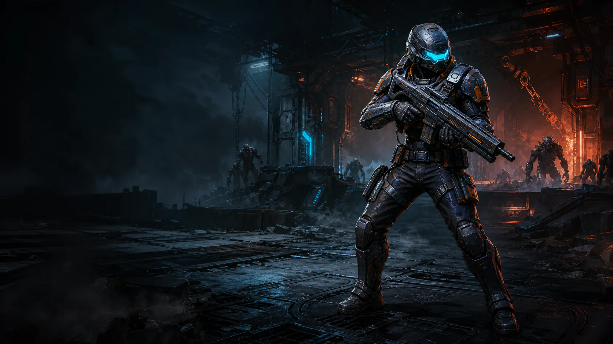
</p>

<p align="center">
  <strong>2D isometric sci-fi survivor action</strong><br />
  Hold the breach. Build your protocol. Survive 20 stages.
</p>

<p align="center">
  <a href="https://jaeshikyoon.github.io/void-breach/?v=413773c"><strong>▶ PLAY ON GITHUB PAGES</strong></a>
  &nbsp; · &nbsp;
  <a href="public/assets/IMAGEGEN_PROMPTS.md">Imagegen asset prompts</a>
</p>

<p align="center">
  
  
  
  
</p>

## The breach is moving

`VOID//BREACH` is a mobile-first 2D isometric arena game. Every run deploys a fixed number of enemies, gives you upgrade choices, and ends with a stage boss. Clear stages with your health intact to earn up to three stars and unlock the next operation.

<p align="center">
  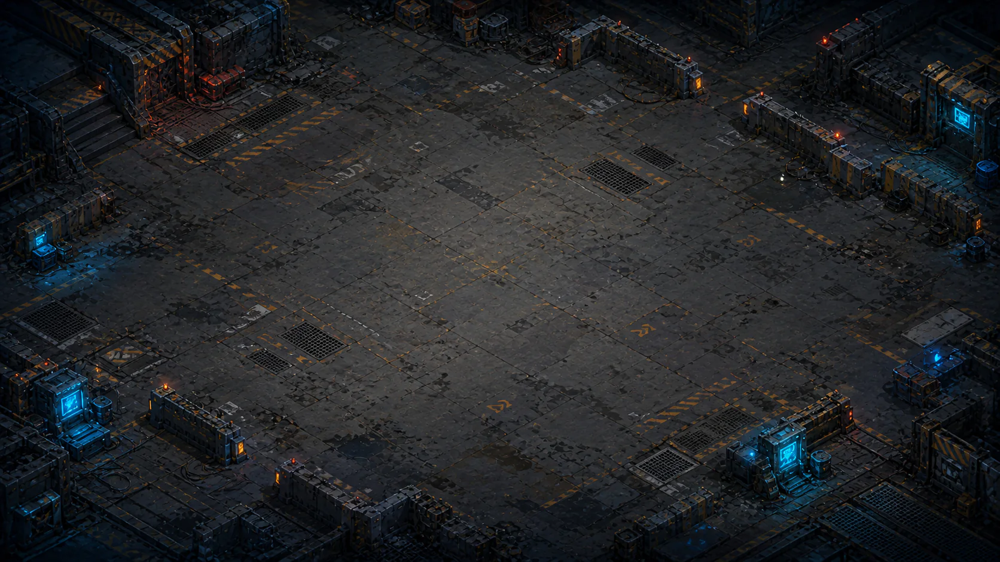
  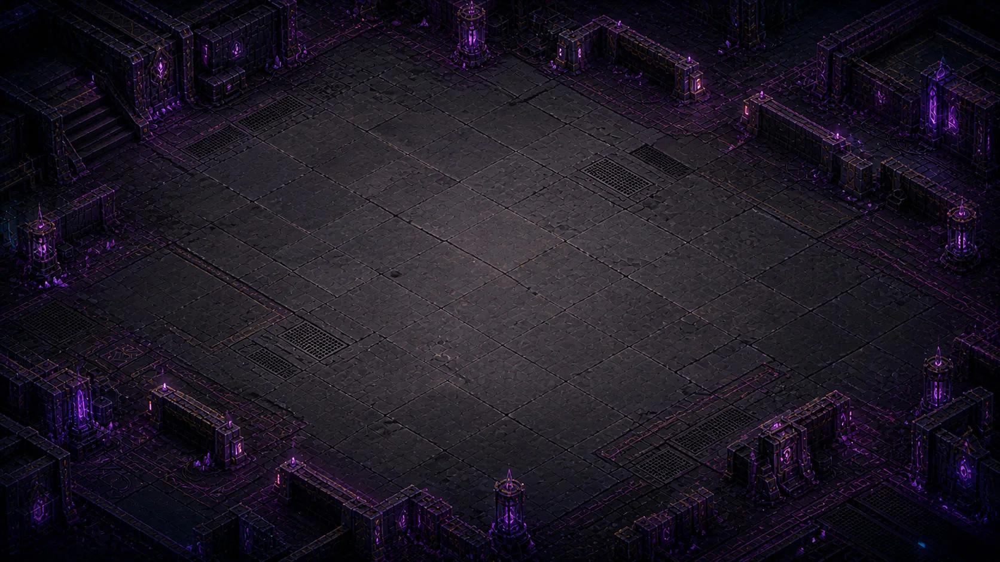
</p>

## What is in the build

| System | Details |
| --- | --- |
| Stage campaign | 20 stages, five themed fronts, sequential unlocks, 0–3 star ratings |
| Enemy roster | 20 enemy types with ranged, swarm, support, elite and special roles |
| Bosses | Five front bosses with phase breaks, authored attack patterns and vulnerability windows |
| Protocols | 10 active skills, three equipped slots, level-up drafts and rerolls |
| Combat feel | Telegraphs before enemy attacks, manual mobile aim, deployable turrets and pickups |
| Persistence | Best stars, fastest clear time and stage progress stored locally |

## Protocols, not placeholders

Every active skill has its own Imagegen icon, color language and gameplay role.

<p align="center">
  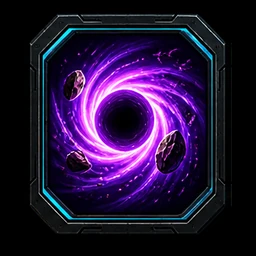
  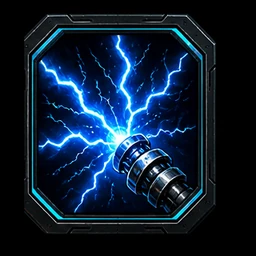
  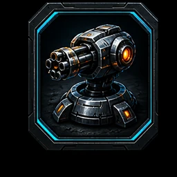
  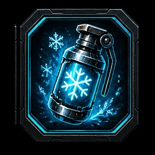
  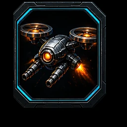
  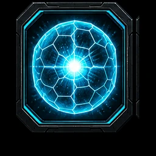
</p>

Build a run around crowd control, burst damage, area denial, or companion fire. Upgrade effects are deliberately separated into active protocols and passive weapon/survival mods so each card has a readable decision.

## Threat board

<p align="center">
  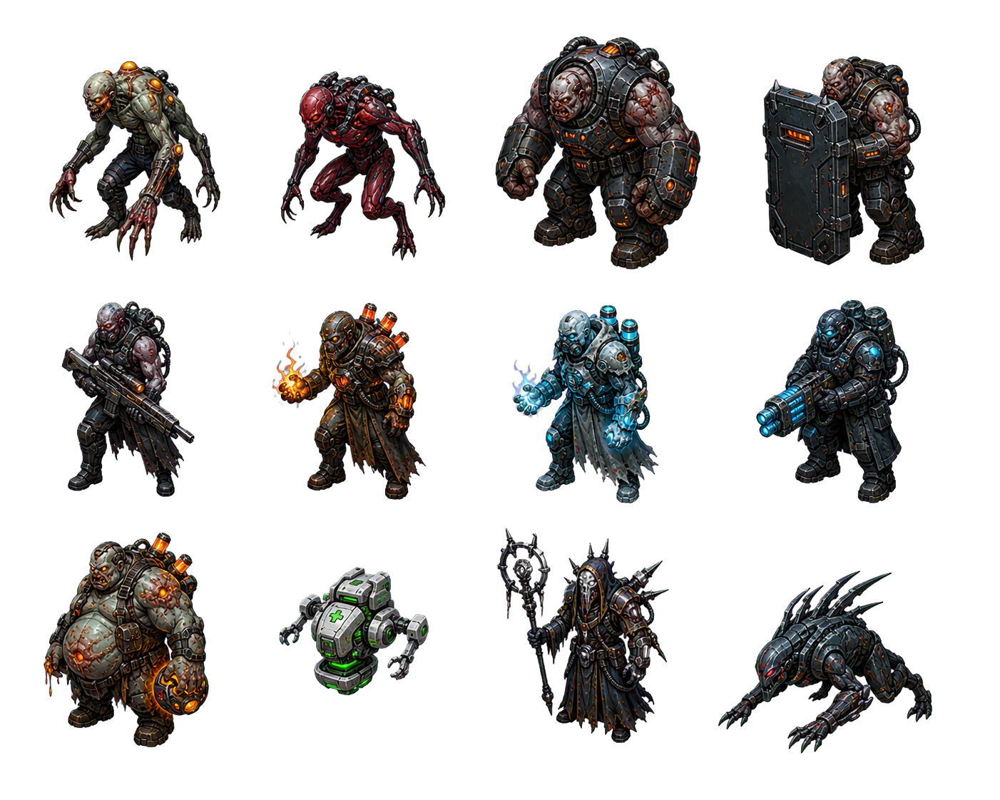
  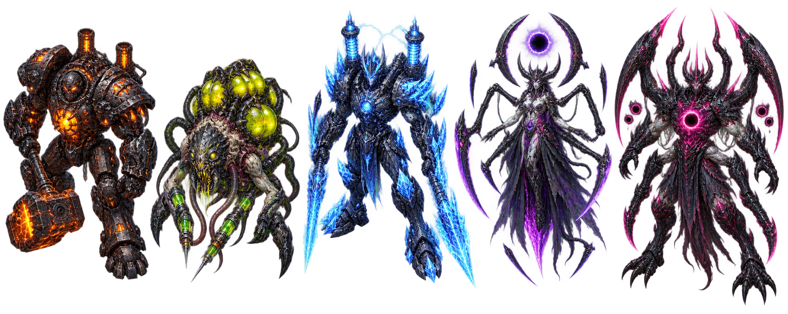
</p>

Five visual fronts keep the campaign readable:

`STAGE 01–04` Industrial Fortress · `05–08` Plague Sector · `09–12` Cryo Research · `13–16` Void Technology · `17–20` Rift Core.

## Controls

### Desktop

| Input | Action |
| --- | --- |
| `WASD` / arrow keys | Move |
| Mouse | Aim |
| Left mouse button | Fire |
| `Space` / right mouse button | Dash |
| `Q` `E` `R` | Active skill slots |
| `Esc` | Pause / resume |
| `1` `2` `3` | Choose a level-up card |

### Mobile

Use the left joystick to move. Hold `FIRE` and drag to aim manually; a tap keeps auto-targeting. Drag a skill button to preview its direction and range before releasing. Skill buttons fan around the attack control, and the orientation overlay offers fullscreen landscape mode when supported.

## Run locally

```bash
npm install
npm run dev
```

Validation commands:

```bash
npm run typecheck
npm run test:run
npm run test:e2e
npm run build
```

## Project map

```text
src/game/core/       deterministic combat rules, stages, bosses, upgrades
src/game/data/       enemies, skills, encounters and balance contracts
src/game/runtime/    PixiJS world, camera, AI, projectiles, VFX and pickups
src/game/services/   input, audio, storage, lifecycle and quality adaptation
src/ui/              React HUD, menus, mobile controls and result screens
src/styles/          desktop, mobile, orientation and modal presentation
public/assets/       Imagegen arena, units, bosses, VFX, props and UI kit
```

## Imagegen asset pipeline

The visual language is built from a consistent dark graphite / cyan-emissive Imagegen kit. The final prompts, atlas cell order and post-processing notes are documented in [`public/assets/IMAGEGEN_PROMPTS.md`](public/assets/IMAGEGEN_PROMPTS.md). All runtime assets are WebP and loaded with safe fallbacks for slower devices.

<p align="center">
  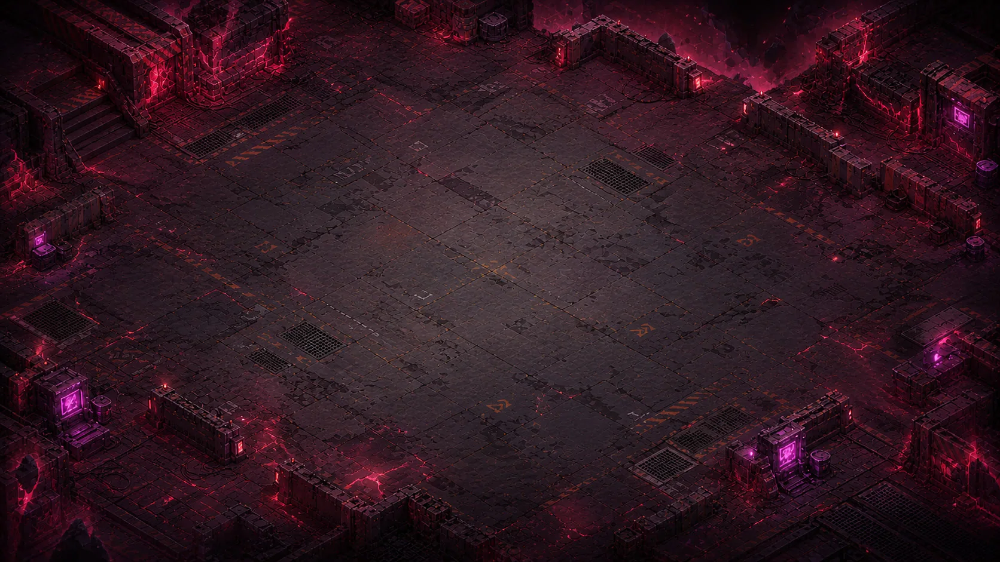
  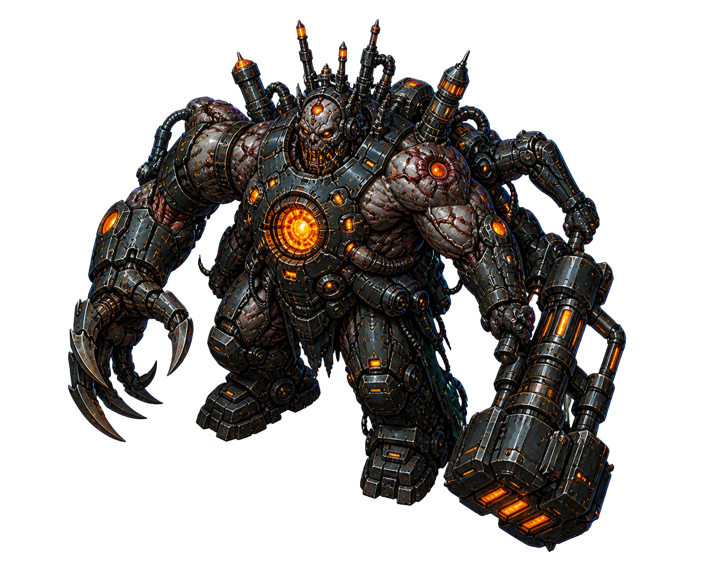
  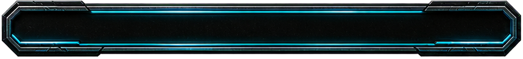
</p>

## License

This repository is a prototype game project. Assets and code are for this project unless otherwise noted.
